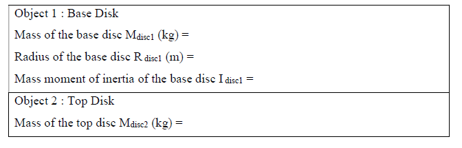
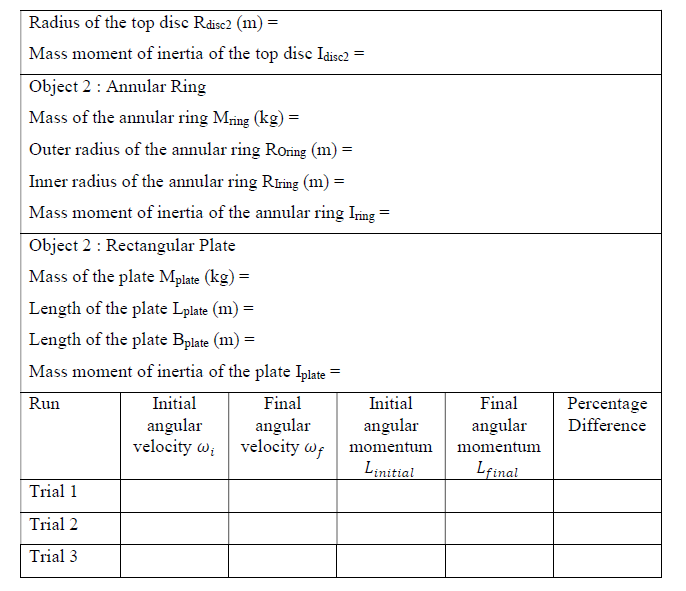

## Procedure

### In real Laboratory

1. Measure the mass and diameter/length of the base solid disk (Object 1) and the other object (Object 2)
from the accessory kit (disks, rings and plates)
2. Connect the Rotary Motion Sensor to your data-collection interface. Level the apparatus using the
bubble level that is included with the Rotational Apparatus.
3. Spin the base disk so that it is rotating reasonably rapidly. Wait for a few seconds before you begin
data collection. Note that the angular velocity gradually decreases during the interval.
4. Hold Object 2 two to three mm above the rotating disc so that it is centered and drop it on to the
rotating disc gently (so as not to induce any torque).
5. From the ω-t plot of the computer system, measure the rotational speed of the mass system just before
and after collision.
6. Repeat the experiment for and tabulate the results as follows

### In Simulation

1. Use sliders to set up the mass and radius of the solid disc and annular rings
2. Click the Play button to initiate the rotation of the disc and the reading of the rotation sensor
3. Click the Drop button to drop the annular ring to the disc
4. From the ω-t plot, determine the angular velocity of the system before and after the drop.

### Sources of Error

1. If the object is dropped off-center, the moment of inertia shall not be about the axis of symmetry,
which is what is presented in your text. Hence, it is important to align the object drop so that they are
centered over the axis of rotation.
2. The dropped object shall be at rest with respect to the rotating disc, before the measurement of the
final angular velocity. Friction between the disks caused them to change their angular velocity until
they were moving at a common angular velocity.

