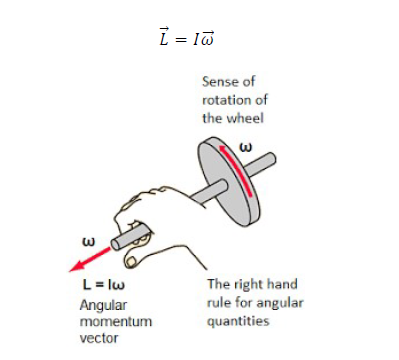
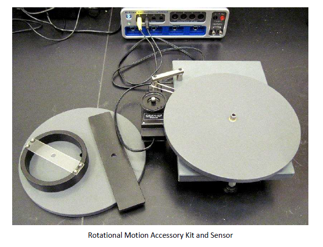

## THEORY

This experiment is designed to familiarize students with the concept of angular momentum and to validate the law of conservation of angular momentum.

### Symbols and Notation

Before proceeding with the theory, the following symbols and their definitions are explicitly defined:

| Symbol | Definition | Units |
|--------|------------|-------|
| $\vec{L}$ | Angular momentum vector | kg·m²/s |
| $\vec{r}$ | Position vector from reference point to particle | m |
| $\vec{v}$ | Linear velocity of particle | m/s |
| $\vec{p}$ | Linear momentum of particle | kg·m/s |
| $m$ | Mass of particle | kg |
| $N$ | Total number of particles in system | --- |
| $\omega$ | Angular velocity of rotation | rad/s |
| $I$ | Moment of inertia about axis of rotation | kg·m² |
| $\tau$ | Torque (rotational force) | N·m |
| $t$ | Time | s |

### Angular Momentum of a Particle

The angular momentum, $\vec{L}$, of a particle with mass $m$ and linear velocity $\vec{v}$ with respect to a fixed reference point (typically the origin) is defined as:

$$\vec{L} = \vec{r} \times \vec{p} = \vec{r} \times (m\vec{v})$$

where:
- $\vec{r}$ is the **position vector** locating the particle relative to the fixed reference point
- $\vec{v}$ is the **linear velocity** of the particle
- $m$ is the **mass** of the particle

### Angular Momentum of a System of Particles

For a system of $N$ particles, each with position vector $\vec{r}_i$ and linear momentum $\vec{p}_i$, the total angular momentum about the fixed reference point is the vector sum of individual angular momenta:

$$\vec{L}_{\text{total}} = \vec{L}_1 + \vec{L}_2 + \cdots + \vec{L}_N = \sum_{i=1}^{N} \vec{L}_i$$

### Angular Momentum of a Rigid Body

To develop the angular momentum expression for a rigid body, we model it as a system of particles with mass $m_i$ that undergo identical rotational motion about a fixed axis. The net angular momentum along the axis of rotation is:

$$\vec{L} = \sum_{i=1}^{N} \vec{L}_i = \sum_{i=1}^{N} m_i (\vec{r}_i \times \vec{v}_i)$$

For rotational motion, the relationship between linear velocity and angular velocity is:

$$\vec{v}_i = \vec{\omega} \times \vec{r}_i$$

Substituting this into the angular momentum equation:

$$\vec{L} = \sum_{i = 1}^{N} m_i \left[ \vec{r}_i \times (\vec{\omega} \times \vec{r}_i) \right]$$

Using vector algebra, this simplifies to:

$$\vec{L} = \vec{\omega} \sum_{i = 1}^{N} m_i r_i^2$$

### Moment of Inertia

The **moment of inertia**, $I$, of a rigid body about the axis of rotation is defined as:

$$I = \sum_{i = 1}^{N} m_i r_i^2$$

This represents the rotational equivalent of mass in translational motion.

### Angular Momentum of Rotating Rigid Body

Using the definition of moment of inertia, the magnitude of angular momentum along the axis of rotation for a rigid body rotating with angular velocity $\omega$ is:

$$L = I\omega$$

### Conservation of Angular Momentum

Newton's second law in angular form relates torque and angular momentum:

$$\vec{\tau} = \frac{d\vec{L}}{dt}$$

The angular momentum of a system of particles around a point in a fixed inertial reference frame is **conserved** (remains constant) if there is no net external torque around that point:

$$\frac{d\vec{L}}{dt} = 0 \quad \Longrightarrow \quad \vec{L}_{\text{total}} = \text{constant}$$

This means:

$$\vec{L}_1 + \vec{L}_2 + \cdots + \vec{L}_N = \text{constant}$$

Note that the **total angular momentum L is conserved**. Individual angular momenta may change, provided their sum remains constant.

### Experimental Setup

The experiment uses a base solid disk that is free to rotate about a vertical spindle. A rotary motion sensor records the disk's angular velocity. The base disk is spun and another object (disk, ring, or plate) is carefully dropped onto it, resulting in a change of angular velocity. The initial and final angular velocities are used to validate conservation of angular momentum.

If $\omega_i$ and $\omega_f$ denote the angular velocities just before and after the drop respectively, the initial and final angular momenta are:

**Initial angular momentum** (base disk only):

$$L_{\text{initial}} = I_{\text{base}} \cdot \omega_i$$

**Final angular momentum** (base disk + dropped object combined):

$$L_{\text{final}} = (I_{\text{base}} + I_{\text{dropped}}) \cdot \omega_f$$

According to conservation of angular momentum:

$$L_{\text{initial}} = L_{\text{final}}$$

$$I_{\text{base}} \cdot \omega_i = (I_{\text{base}} + I_{\text{dropped}}) \cdot \omega_f$$

