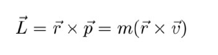
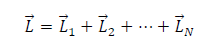
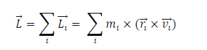
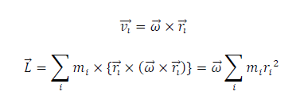
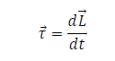
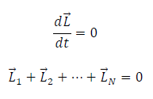

# THEORY
This experiment is devised to familiarize with the concept of angular momentum and to validate the law of
conservation of angular momentum.
## Angular Momentum
The angular momentum, L, of a particle with a mass m and a linear velocity 𝑣⃗ concerning a fixed point,
typically the origin is given as

The 𝑟⃗ term is once again the position vector locating the particle relative to a fixed point. If we have a system
of N particles, each with position vector rl and each having momentum pl, then the total angular momentum
of the system of particles about the fixed point is the vector sum of the individual angular momenta

To develop the angular momentum of a rigid body, we model a rigid body as being made up of a system of
particles, with mass mi that undergo the same rotational motion about the point. The net angular momentum
of the rigid body along the axis of rotation is

 If the angular velocity of rotation is 
  

The summation Σi 𝑚iri^2 is simply the moment of inertia I of the rigid body about the axis of rotation. Thus,
the magnitude of the angular momentum along the axis of rotation of a rigid body rotating with angular
velocity ω about the axis is

## Conservation of Angular Momentum
Similar to translational motion, we can write Newton’s second law in angular form, that is in terms of torque
and angular momentum as

The angular momentum of a system of particles around a point in a fixed inertial reference frame is conserved
if there is no net external torque around that point:

Note that the total angular momentum L is conserved. Any of the individual angular momenta can change as
long as their sum remains constant.

## Experimental Setup
The experiment involves a bottom solid disc that can rotate about a vertical spindle. A rotary motion
sensor under the disc’s angular velocity. This bottom disk is given a spin and the other objects are carefully
dropped on top of it, resulting in a change of the angular velocity. The system's initial and final angular velocities can be used to validate the principle of conservation of angular momentum. If 𝜔􀯜 and 𝜔􀯙 are the
angular velocities just before and after the drop respectively, the initial and final angular momentum are given
as

